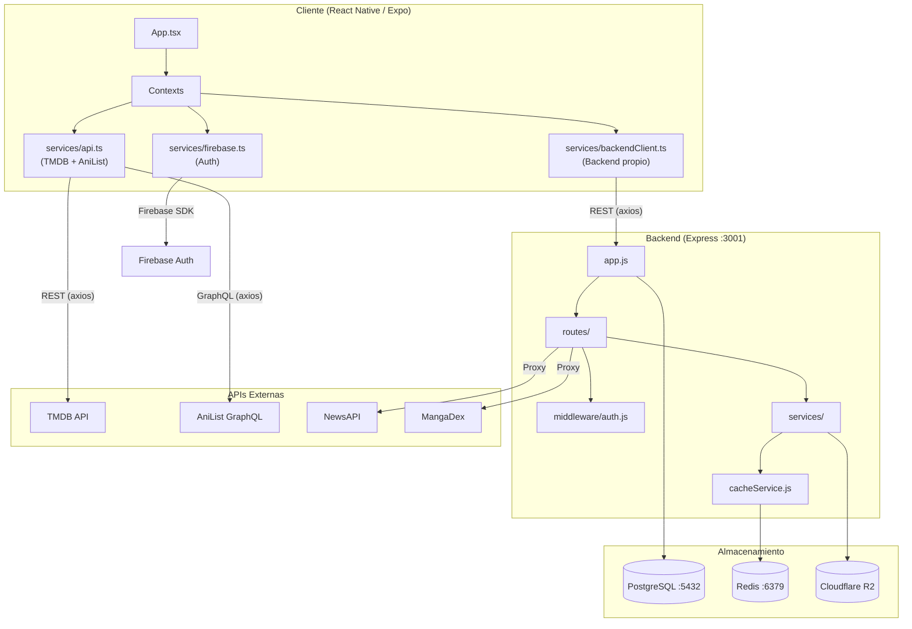

# Pixel no Sekai — Resumen Técnico de Arquitectura

> **Fecha del análisis:** 2026-07-03  
> **Nombre del proyecto:** `pixel-no-sekai`  
> **Versión:** 1.0.0

---

## 1. Árbol de Directorios

```
pixel/
├── App.tsx                       # Entry point — monta los Providers y el Navigator
├── index.ts                      # Registro de la app con Expo
├── package.json                  # Dependencias del cliente (React Native / Expo)
├── docker-compose.yml            # Orquestación: PostgreSQL, Backend, Redis, Adminer
├── theme.ts                      # Design tokens: colores (dark/light), spacing
├── types.ts                      # Tipos TypeScript globales (Movie, Anime, ContentItem, Nav params…)
│
├── components/                   # Componentes React Native reutilizables
│   ├── AnimeSeriesModal.tsx      #   Modal detalle de anime (~82 KB, componente más grande)
│   ├── EpisodePlayer.tsx         #   Player de episodios con soporte HLS
│   ├── FeaturedCarousel.tsx      #   Carrusel hero de la pantalla Home
│   ├── FeaturedMovie.tsx         #   Tarjeta destacada de película/anime
│   ├── Header.tsx                #   Header global con búsqueda y navegación
│   ├── MovieCard.tsx             #   Card genérica de contenido
│   ├── MovieModal.tsx            #   Modal detalle de película/serie
│   ├── MovieRow.tsx              #   Fila horizontal de contenido
│   ├── LoadingScreen.tsx         #   Splash screen animada
│   ├── MangaComponents.tsx       #   Componentes de manga
│   ├── MyListComponents.tsx      #   Componentes de Mi Lista
│   ├── NewsComponents.tsx        #   Componentes de noticias
│   ├── ConfirmDialog.tsx         #   Diálogo de confirmación reutilizable
│   ├── PressableScale.tsx        #   Botón con animación de escala
│   ├── admin/                    #   AdminNav, AdminShell, AdminSidebar
│   ├── anime-modal/              #   Sub-componentes del modal de anime
│   ├── modals/                   #   CreateProfileModal, DeleteProfileModal
│   └── profile/                  #   ContentPanel, Sidebar, SubNav del perfil
│
├── contexts/                     # Estado global con React Context
│   ├── AuthContext.tsx           #   Sesión de usuario (Firebase + AsyncStorage)
│   ├── ProfileContext.tsx        #   Perfil activo y preferencias (+18)
│   ├── MyListContext.tsx         #   Mi Lista (sincroniza con backend via API)
│   ├── AdminContext.tsx          #   Estado de admin (Google OAuth + whitelist de emails)
│   └── ThemeContext.tsx          #   Tema dark/light
│
├── hooks/                        # Custom hooks
│   ├── useProfileManagement.ts   #   CRUD de perfiles
│   ├── useProfileScreenLogic.ts  #   Lógica completa de ProfileScreen
│   └── useTabNavigation.ts      #   Navegación por tabs
│
├── navigation/
│   └── AppNavigator.tsx          # Navegación: RootStack → Tabs → Nested stacks
│
├── screens/                      # Pantallas de la app
│   ├── HomeScreen.tsx            #   Pantalla principal (catálogo)
│   ├── SearchScreen.tsx          #   Búsqueda unificada
│   ├── LoginScreen.tsx           #   Login (email/password + Google)
│   ├── RegisterScreen.tsx        #   Registro de usuario
│   ├── ProfileSelectionScreen.tsx#   Selector de perfil (estilo Netflix)
│   ├── ProfileScreen.tsx         #   Configuración del perfil
│   ├── CategoryScreen.tsx        #   Vista por categoría
│   ├── MyListScreen.tsx          #   Mi Lista
│   ├── DownloadsScreen.tsx       #   Descargas offline
│   ├── NewsScreen.tsx            #   Feed de noticias anime
│   ├── NewsDetailScreen.tsx      #   Detalle de noticia
│   ├── MangaScreen.tsx           #   Catálogo de manga
│   ├── MangaDetailScreen.tsx     #   Detalle de manga
│   ├── MangaReaderScreen.tsx     #   Lector de capítulos
│   ├── AppearanceScreen.tsx      #   Configuración de apariencia
│   └── admin/                    #   Panel de administración
│       ├── AdminLoginScreen.tsx
│       ├── AdminDashboardScreen.tsx
│       ├── AdminImportScreen.tsx  #   Importación masiva de anime vía M3U
│       ├── AnimeListScreen.tsx    #   CRUD de anime
│       ├── AnimeFormScreen.tsx    #   Formulario de creación/edición
│       └── EpisodeManagerScreen.tsx # Gestión de episodios + transcoding
│
├── services/                     # Capa de servicios (API clients)
│   ├── api.ts                    #   ★ Cliente principal: TMDB + AniList unificado
│   ├── anilistService.ts         #   Cliente GraphQL para AniList
│   ├── animeStreamingService.ts  #   Resolución de URLs de streaming
│   ├── animeDatabaseService.ts   #   Consultas al catálogo interno de anime
│   ├── backendClient.ts          #   Instancia Axios para el backend propio
│   ├── databaseService.ts        #   Conectividad y descubrimiento de red
│   ├── auth.ts                   #   Firebase Auth helpers
│   ├── firebase.ts / .native.ts / .web.ts  # Configuración Firebase platform-aware
│   ├── adminAuthService.ts       #   Auth de admin (Google OAuth → JWT)
│   ├── adminApiService.ts        #   API del panel de admin
│   ├── catalogService.ts         #   Catálogo del backend propio
│   ├── myListApi.ts              #   CRUD de Mi Lista (→ /my-list)
│   ├── progressApi.ts            #   Progreso de visualización
│   ├── continueWatchingApi.ts    #   Continuar viendo
│   ├── resumeTargetApi.ts        #   Resume target (episodio a retomar)
│   ├── mangaApi.ts               #   API de manga
│   ├── newsApi.ts                #   API de noticias
│   ├── m3uParser.ts              #   Parser de archivos M3U para importar anime
│   ├── offlineDownloads.ts       #   Gestión de descargas offline
│   ├── connectivity.ts           #   Utilidades de conectividad
│   └── googleSignin.*.ts         #   Google Sign-In (platform-specific)
│
├── data/                         # Datos mock para desarrollo
│   ├── mockManga.ts
│   └── mockNews.ts
│
├── utils/
│   ├── networkUtils.ts           # Detección de IP del servidor backend
│   └── networkStorage.ts         # Persistencia de configuración de red
│
├── types/
│   └── navigation.ts             # Tipos adicionales de navegación
│
├── assets/                       # Iconos y splash screens
├── android/                      # Proyecto Android nativo (Expo managed)
│
└── server/                       # ★ BACKEND (Node.js / Express)
    ├── index.js                  #   Server bootstrap (listen en PORT 3001)
    ├── app.js                    #   Express app: middleware, rutas, CORS
    ├── db.js                     #   Pool de PostgreSQL (node-pg)
    ├── Dockerfile                #   Imagen Docker del backend
    ├── bd_netflix_postgres.sql   #   Schema principal de la BD
    ├── admin_schema.sql          #   Schema del panel admin (anime_content, anime_episodes)
    ├── migrate_*.sql             #   Migraciones incrementales
    ├── routes/                   #   18 archivos de rutas Express
    │   ├── auth.js               #     Google OAuth + Firebase token login
    │   ├── userAuth.js           #     Register/Login por email+password (bcrypt+JWT)
    │   ├── admin.js              #     CRUD admin (~36 KB, la ruta más extensa)
    │   ├── catalog.js            #     Catálogo público de anime
    │   ├── myList.js             #     Mi Lista (header-based con X-Profile-Id)
    │   ├── progress.js           #     Watch progress
    │   ├── continueWatching.js   #     Continue watching
    │   ├── resumeTarget.js       #     Resume target
    │   ├── profiles.js           #     CRUD de perfiles
    │   ├── downloads.js          #     Gestión de descargas
    │   ├── news.js               #     Proxy + cache de noticias (NewsAPI)
    │   ├── manga.js              #     Proxy de manga (MangaDex)
    │   ├── transcode.js          #     Trigger de transcodificación HLS
    │   ├── uploads.js            #     Subida de archivos (multer)
    │   ├── content.js            #     Endpoints genéricos de contenido
    │   ├── proxy.js              #     CORS proxy + traducción
    │   ├── images.js             #     Metadata de imágenes
    │   └── user.js               #     Info de usuario
    ├── middleware/
    │   └── auth.js               #   JWT verification middleware
    ├── services/                 #   Lógica de negocio del backend
    │   ├── animeImportService.js #     Importación masiva desde M3U
    │   ├── cacheService.js       #     Cache layer con Redis (ioredis)
    │   ├── r2Service.js          #     Cloudflare R2 storage (AWS S3 SDK)
    │   ├── transcodeHlsService.js#     FFmpeg → HLS
    │   ├── transcodeQueueService.js #  Cola de transcoding
    │   ├── transcodeQueueWorker.js #   Worker de transcoding
    │   ├── newsService.js        #     Agregación de noticias anime
    │   ├── newsScheduler.js      #     Cron de noticias
    │   ├── mangaService.js       #     Proxy/cache de manga (MangaDex)
    │   ├── mangaScheduler.js     #     Cron de manga
    │   └── importM3uStorageService.js # Almacenamiento de importaciones M3U
    ├── db/
    │   └── ensureTables.js       #   Creación/verificación de tablas al boot
    ├── migrations/               #   node-pg-migrate
    │   ├── 001_baseline.cjs
    │   └── 002_pns_runtime_tables.cjs
    └── admin/                    #   Admin panel HTML estático
        ├── index.html
        ├── dashboard.html
        ├── import.html
        ├── css/ & js/
```

---

## 2. Stack y Dependencias

### Frontend (React Native / Expo)

| Capa | Tecnología | Versión | Propósito |
|------|-----------|---------|-----------|
| **Framework** | React Native | 0.81.5 | UI nativa multiplataforma |
| **Plataforma** | Expo | 54.0.25 | Build system, dev tools, OTA updates |
| **Lenguaje** | TypeScript | 5.9.2 | Tipado estático |
| **Navegación** | React Navigation 7 | 7.x | Stack, Bottom Tabs, Nested navigators |
| **Estado global** | React Context API | — | 5 contextos (Auth, Profile, MyList, Admin, Theme) |
| **Persistencia local** | AsyncStorage | 2.2.0 | Sesión, perfil, preferencias |
| **HTTP Client** | Axios | 1.12.2 | Comunicación con TMDB, AniList, backend propio |
| **Auth** | Firebase Auth | 12.6.0 | Google Sign-In + email/password |
| **Animaciones** | Reanimated 4.1 | 4.1.1 | Micro-animaciones, transiciones |
| **Gestos** | Gesture Handler | 2.28.0 | Swipe, pinch-to-zoom (manga reader) |
| **WebView** | react-native-webview | 13.15.0 | Player de video embebido |
| **Gradientes** | expo-linear-gradient | 15.0.8 | UI visual (cards, headers) |
| **Iconos** | @expo/vector-icons (Ionicons) | 15.0.3 | Iconografía |

### Backend (Node.js / Express)

| Capa | Tecnología | Versión | Propósito |
|------|-----------|---------|-----------|
| **Runtime** | Node.js | (Docker) | Entorno de ejecución |
| **Framework** | Express | 4.19.2 | REST API |
| **Módulos** | ESM (`"type": "module"`) | — | `import/export` nativo |
| **Base de datos** | PostgreSQL 16 | Alpine | Almacenamiento principal |
| **Driver BD** | pg (node-postgres) | 8.13.1 | Pool de conexiones |
| **Migraciones** | node-pg-migrate | 8.0.4 | Versionado de schema |
| **Cache** | Redis 7 | Alpine | Caching de noticias, manga, catálogo |
| **Driver Redis** | ioredis | 5.10.1 | Cliente Redis |
| **Auth** | Passport.js | 0.7.0 | Google OAuth 2.0 |
| **JWT** | jsonwebtoken | 9.0.2 | Tokens de sesión (admin + user) |
| **Hashing** | bcryptjs | 2.4.3 | Hash de contraseñas |
| **File upload** | Multer | 2.0.2 | Subida de imágenes y videos |
| **Object Storage** | AWS SDK S3 (Cloudflare R2) | 3.1028.0 | Almacenamiento de videos HLS |
| **HTTP Client** | Axios | 1.13.5 | Proxy a APIs externas |
| **Containerización** | Docker Compose 3.8 | — | PostgreSQL + Backend + Redis + Adminer |

### APIs Externas Integradas

| API | Uso |
|-----|-----|
| **TMDB (The Movie Database)** | Catálogo de películas y series |
| **AniList (GraphQL)** | Catálogo de anime |
| **NewsAPI** | Noticias de anime/manga |
| **MangaDex** | Catálogo y lectura de manga |
| **Google OAuth 2.0** | Autenticación de administradores |
| **Firebase** | Auth de usuarios + Firestore para preferencias |
| **Cloudflare R2** | Almacenamiento CDN de videos transcodificados (HLS) |
| **LibreTranslate / DeepL** | Traducción de descripciones |

---

## 3. Flujo de Datos y APIs

### Diagrama de Comunicación



### Flujo de Autenticación

1. **Login de usuario**: `LoginScreen` → Firebase Auth (email/password o Google Sign-In) → `AuthContext` guarda sesión en AsyncStorage
2. **Login de admin**: Firebase Auth → el `AdminContext` envía el ID Token al backend → `POST /auth/firebase` valida contra whitelist de emails → devuelve JWT → se almacena en AsyncStorage como `admin_token`
3. **Register**: `RegisterScreen` → `POST /auth/register` (backend) → bcrypt hash → inserta en `usuarios` → devuelve JWT

### Flujo de Datos del Catálogo

```
HomeScreen
  └─→ services/api.ts
       ├─→ AniList GraphQL (anime popular, top rated, airing)
       ├─→ TMDB REST API (películas y series)
       └─→ Unifica como ContentItem[] con campo `source: 'tmdb' | 'anilist'`
            └─→ Renderiza en MovieRow → MovieCard
                  └─→ onPress → AnimeSeriesModal / MovieModal
```

### Comunicación Cliente ↔ Servidor (Backend propio)

| Endpoint | Método | Descripción | Header requerido |
|----------|--------|-------------|------------------|
| `/auth/register` | POST | Registro con email/password | — |
| `/auth/login` | POST | Login con email/password → JWT | — |
| `/auth/firebase` | POST | Login con Firebase ID Token → JWT | — |
| `/profiles` | GET/POST/PUT/DELETE | CRUD de perfiles | `Authorization: Bearer <jwt>` |
| `/my-list` | GET/POST/DELETE | Mi Lista (header-based) | `X-Profile-Id` |
| `/my-list/:perfilId` | GET/POST/DELETE | Mi Lista (param-based, legacy) | — |
| `/progress` | GET/POST | Progreso de visualización | `X-Profile-Id` |
| `/continue-watching` | GET | Continuar viendo | `X-Profile-Id` |
| `/resume-target` | GET/PUT | Episodio a retomar | `X-Profile-Id` |
| `/api/catalog` | GET | Catálogo interno de anime | — |
| `/api/news` | GET | Noticias (proxy + cache Redis) | — |
| `/api/manga` | GET | Manga (proxy MangaDex + cache) | — |
| `/api/admin/*` | CRUD | Panel de administración completo | JWT admin |
| `/transcode` | POST | Inicia transcoding HLS | JWT admin |
| `/upload` | POST | Subida de archivos (multer) | JWT admin |
| `/downloads` | GET/POST/DELETE | Gestión de descargas | Perfil ID |
| `/health` | GET | Health check + status de BD | — |

### Estrategia de Caching

El backend usa **Redis** como capa de cache para:
- Respuestas de NewsAPI (noticias)
- Respuestas de MangaDex (catálogo de manga)
- Catálogo interno de anime

El servicio `cacheService.js` encapsula las operaciones `GET/SET` con TTL configurable.

---

## 4. Últimos Cambios (Análisis del historial Git)

### Commit `7795d28` — "actualizado" (HEAD)
- Refactorización mayor del backend: **extracción de rutas monolíticas** de `index.js` hacia un [app.js](file:///c:/Users/ASUS/Documents/Projects/pixel/server/app.js) modular.
- Se crearon **6 nuevos archivos de rutas**: `userAuth.js`, `profiles.js`, `downloads.js`, `proxy.js`, `uploads.js`, `content.js`.
- Se añadieron servicios de **noticias** (`newsService.js`, `newsScheduler.js`) y **manga** (`mangaService.js`, `mangaScheduler.js`).
- Integración de **Cloudflare R2** para storage de videos HLS.
- Se actualizó el servicio de auth para soportar login con Firebase token.
- **45 archivos modificados, +4295 / -321 líneas**.

### Commit `09e7321` — "2.6"
- Reescritura masiva de componentes UI: `AnimeSeriesModal`, `EpisodePlayer`, `FeaturedMovie`, `Header`, `MovieCard`.
- Nuevo sistema de **MyListContext** refactorizado para usar claves compuestas `type:id`.
- Nuevos componentes: `MangaComponents`, `MyListComponents`, `NewsComponents`, `ConfirmDialog`.
- Nuevo hook: `useTabNavigation`.
- Rutas backend: `continueWatching.js`, `myList.js`, `progress.js`.
- Servicios frontend: `backendClient.ts`, `myListApi.ts`, `progressApi.ts`, `continueWatchingApi.ts`, `offlineDownloads.ts`.
- Tabla `pns_my_list_items` y `pns_watch_progress` en el schema SQL.
- **37 archivos, +6106 / -2278 líneas**.

### Commit `87a7917` — "2.5"
- Panel de administración completo: `AdminDashboardScreen`, `AnimeFormScreen`, `AnimeListScreen`, `EpisodeManagerScreen`.
- Arquitectura de perfiles refactorizada: `useProfileManagement`, `useProfileScreenLogic`, componentes `profile/` y `modals/`.
- Soporte multiplatforma en `ProfileScreen.web.tsx` y `ProfileScreen.web.styles.ts`.
- Docker: adición de Redis y Adminer al `docker-compose.yml`.
- Cloudflare R2 service + transcoding HLS pipeline.
- Migraciones para `franchise_key`, `episode_status`, y R2 storage.
- **68 archivos, +8144 / -2942 líneas**.

> [!IMPORTANT]
> La tendencia es clara: el proyecto está en una fase de **crecimiento acelerado** con refactorizaciones significativas en cada versión. La extracción de `index.js` en `app.js` + rutas modulares (commit HEAD) indica una maduración de la arquitectura backend.

---

## 5. Modelos y Estado

### 5.1 Entidades Principales en PostgreSQL

```mermaid
erDiagram
    usuarios ||--o{ perfiles : "tiene"
    usuarios ||--o{ password_resets : "solicita"
    perfiles ||--o{ listas : "tiene"
    listas ||--o{ lista_items : "contiene"
    perfiles ||--o{ descargas : "tiene"
    descargas ||--o{ descarga_items : "contiene"
    anime_content ||--o{ anime_episodes : "tiene"
    admin_users {
        int id PK
        varchar google_id UK
        varchar email UK
        varchar name
        varchar picture
        timestamp last_login
    }
    usuarios {
        int id PK
        varchar email UK
        varchar password_hash
        enum role "user | admin"
        timestamp created_at
    }
    perfiles {
        int id PK
        int usuario_id FK
        varchar name
        varchar avatar_url
        boolean is_kids
    }
    listas {
        int id PK
        int perfil_id FK
        varchar name
        enum type "MY_LIST"
    }
    lista_items {
        int id PK
        int lista_id FK
        int content_id
        enum content_type "movie | tv | anime"
    }
    pns_my_list_items {
        int id PK
        bigint profile_id
        int content_id
        text content_type
        timestamp added_at
    }
    pns_watch_progress {
        int id PK
        bigint profile_id
        int anime_id
        int episode_id
        int current_seconds
        int duration_seconds
    }
    contenido {
        int id PK
        varchar title
        enum type "movie | tv | anime"
        text overview
        varchar poster_url
        varchar backdrop_url
    }
    imagenes {
        int id PK
        varchar filename
        varchar url
        enum type "poster | backdrop | avatar | thumbnail"
        enum entity_type "contenido | perfil | anime"
        int entity_id
    }
    password_resets {
        int id PK
        int usuario_id FK
        varchar token UK
        timestamp expires_at
        boolean used
    }
    descargas {
        int id PK
        int perfil_id FK UK
        varchar name
    }
    descarga_items {
        int id PK
        int descarga_id FK
        int content_id
        enum content_type
        enum status "PENDING | DOWNLOADING | COMPLETED | FAILED"
        smallint progress
    }
    anime_content {
        int id PK
        int tmdb_id
        varchar title
        varchar franchise_key
        varchar title_english
        varchar title_japanese
        text description
        text[] genres
        varchar status
        decimal rating
    }
    anime_episodes {
        int id PK
        int anime_id FK
        int season
        int episode_number
        varchar video_url
        varchar stream_url
        varchar status "missing | queued | processing | ready | error"
        varchar storage_type "gdrive | local | r2 | external"
        varchar quality
    }
```

> [!NOTE]
> Existen **dos sistemas de listas paralelos**: el legacy (`listas` + `lista_items`, vinculado a `perfiles`) y el nuevo (`pns_my_list_items`, independiente con `profile_id` como BIGINT). El `MyListContext` del frontend ya utiliza el sistema nuevo vía `myListApi`.

### 5.2 Estado Global en el Frontend

El estado se gestiona exclusivamente con **React Context API** (sin Redux, Zustand ni MobX). Jerarquía de providers en [App.tsx](file:///c:/Users/ASUS/Documents/Projects/pixel/App.tsx):

```
SafeAreaProvider
  └─ ThemeProvider             ← Tema dark/light
      └─ AuthProvider          ← Sesión de usuario (Firebase)
          └─ AdminProvider     ← Estado de administrador
              └─ ProfileProvider ← Perfil activo + preferencias +18
                  └─ MyListProvider ← Mi Lista (sincronizada con backend)
                      └─ AppNavigator
```

| Contexto | Persistencia | Fuente de verdad | Datos principales |
|----------|-------------|-------------------|-------------------|
| [ThemeContext](file:///c:/Users/ASUS/Documents/Projects/pixel/contexts/ThemeContext.tsx) | En memoria (default: `dark`) | Local | `theme`, `colors`, `spacing` |
| [AuthContext](file:///c:/Users/ASUS/Documents/Projects/pixel/contexts/AuthContext.tsx) | AsyncStorage (`userSession`) | Firebase Auth + local | `user { uid, email, role }`, `isLoading` |
| [AdminContext](file:///c:/Users/ASUS/Documents/Projects/pixel/contexts/AdminContext.tsx) | AsyncStorage (`admin_token`) | Backend JWT + email whitelist | `isAdmin`, `adminUser`, `checkAdminStatus()` |
| [ProfileContext](file:///c:/Users/ASUS/Documents/Projects/pixel/contexts/ProfileContext.tsx) | AsyncStorage (`currentProfile`, `adultContentEnabled:<id>`) + Firestore | Dual (local + Firebase) | `currentProfile`, `adultContentEnabled` |
| [MyListContext](file:///c:/Users/ASUS/Documents/Projects/pixel/contexts/MyListContext.tsx) | Backend (`/my-list`) | Backend API | `myListItems: Set<string>` (keys: `type:id`) |

### Patrón de estado

- **Optimistic updates**: `MyListContext` actualiza el `Set` local inmediatamente y sincroniza con el backend en segundo plano.
- **Persistencia dual**: `ProfileContext` guarda en AsyncStorage (local) **y** sincroniza preferencias de contenido adulto con Firestore (remoto).
- **Session recovery**: `AuthContext` carga la sesión de AsyncStorage al inicio y la mantiene sincronizada con Firebase `onAuthStateChanged`.
- **Navegación persistente**: `AppNavigator` guarda y restaura el estado de navegación completo en AsyncStorage (`NAVIGATION_STATE`).

---

## Resumen Ejecutivo

| Dimensión | Estado |
|-----------|--------|
| **Arquitectura** | Monorepo con frontend (Expo/RN) y backend (Express) separados en directorios |
| **Madurez** | En crecimiento rápido — refactorizaciones grandes en cada versión |
| **Modularidad backend** | Buena (18 archivos de rutas, 11 servicios, middleware aislado) |
| **Modularidad frontend** | Media (componentes grandes como `AnimeSeriesModal` de 82KB) |
| **Testing** | No se incluyen tests en el repositorio actual para facilitar despliegues |
| **CI/CD** | Listo para ser clonado y desplegado vía Docker Compose |
| **Dockerización** | Completa para backend, PostgreSQL, Redis y Adminer |
| **Despliegue** | Orientado a VPS (Ubuntu/Debian) usando contenedores |
| **Deuda técnica** | Dos sistemas de listas paralelos, rutas legacy en `app.js`, logs de debug en producción |

---

## 6. Topología de Despliegue en Producción (VPS)

El sistema está diseñado para ser desplegado fácilmente en un **Virtual Private Server (VPS)** usando Docker Compose:

1. **Proxy Inverso (Nginx/Traefik)**: Se recomienda para manejar certificados SSL (HTTPS) y enrutar el tráfico al puerto expuesto por el backend Node.js y a los estáticos compilados de Expo Web.
2. **Contenedores de Backend**:
   - `backend`: Servidor Express Node.js.
   - `postgres`: Base de datos relacional.
   - `redis`: Servidor de caché en memoria.
3. **Frontend Móvil**: Compilado localmente o mediante EAS Build (Expo Application Services) generando los APKs o bundles iOS que apuntan a la URL pública del VPS.

El proceso de preparación para producción incluye remover archivos de pruebas y utilidades innecesarias del repositorio, asegurando un clonado limpio y rápido en el servidor de destino.
